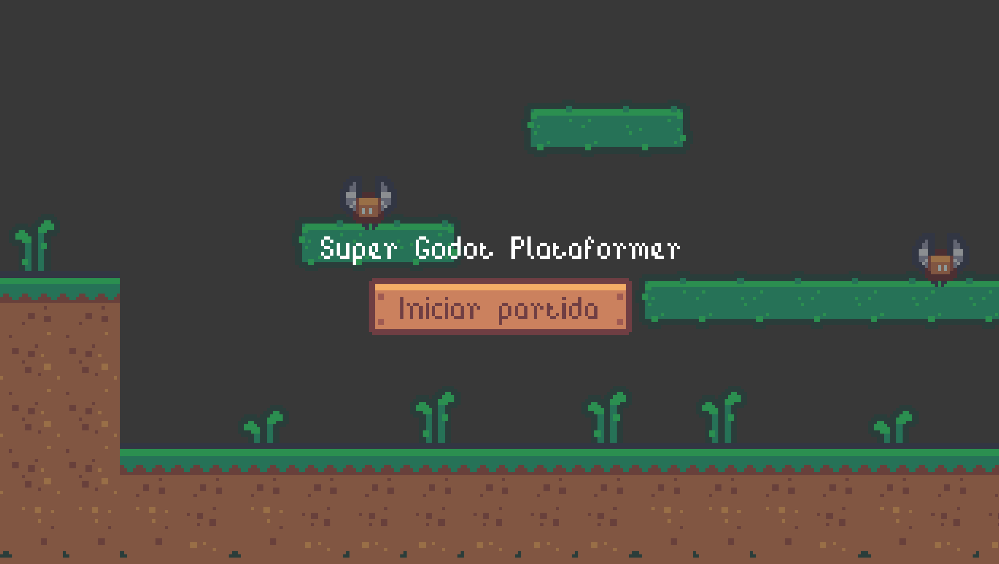
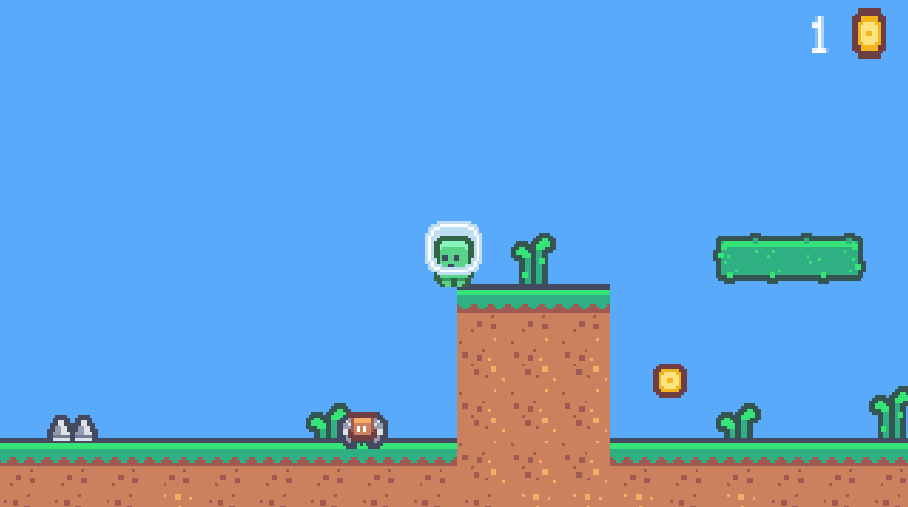

# Godot Platforms 2D

Game developed as part of the [Curso Intensivo Creación de Videojuegos con Godot](https://stegaacademy.es/pdf/dossiergodot.pdf) from [Stega Academy](https://stegaacademy.es/). 

This is the first game developed in the course.

The game has only two little leves which loop until you close the game. When you finish the first level you go to the second one, and when you finish the seconds one you start again.

## TODO

- [] Add pause menu
- [] Add more sounds

## Screenshots

## How to play?

Go to [itch.io](https://ismanapa.itch.io/godot-platforms-2d?password=stega) and select "Run game". The game will open in fullscreen. 

### Controls

- Keyboard arrows to move
- Space to jump
- Q to dash